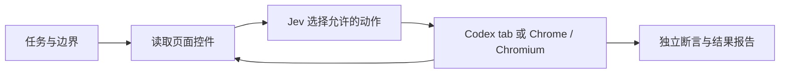

# Jev Computer Use

**让 Jev 选择动作，让浏览器执行，让证据决定是否完成。**

独立的浏览器自动化 Skill，基于 [Jev Browser Use](https://github.com/wy-coliney/jev-browser-use)
扩展。既可以接入 Codex 已有的 Computer Use 接口，也可以独立驱动 Chrome／Chromium。
无需安装 Jev Skills Market。社区项目，与 TypeSafe、OpenAI 无隶属关系。

> v0.1.0 是开发预览：可运行的浏览器适配器与测试，不是完整桌面应用。



## 安装 Skill

```sh
npx skills add https://github.com/kangshifu1/jev-computer-use/tree/v0.1.0 --skill jev-computer-use -g -a codex
```

安装仅提供 Skill 文件。Codex 模式仍需实际可用的浏览器工具；独立模式需要下面的驱动依赖。
提供 `.codex-plugin/plugin.json` 作为原生插件打包入口；推荐先使用上述经过发现验证的 Skill 方式。

## 独立运行

```sh
git clone https://github.com/kangshifu1/jev-computer-use.git
cd jev-computer-use
git checkout v0.1.0
npm ci
npx playwright install chromium

# 验证任务并预览；不会访问网页或调用模型
npm start -- --task examples/browser-task.json
```

任务中的本地 URL 是示例测试站点，实际运行前需要启动目标站点或改成自己的地址。
设置本地配置，格式参考 [config.example.json](examples/config.example.json)。`envFile`
指向存放 `TYPESAFE_API_KEY` 的本地 dotenv 文件；OpenRouter 也受支持。

```sh
# 实际调用模型并操作隔离浏览器；需要有效凭据与可访问的目标站点
npm start -- --task /absolute/path/task.json --config /absolute/path/config.json --act --headed

# 使用本机已有的 Chrome
npm start -- --task /absolute/path/task.json --config /absolute/path/config.json --act --browser chrome --headed
```

API 密钥放在本地后端，不放在网页、Git 或聊天消息里。页面文本、任务目标与动作历史
会发送给你选定的模型服务商。不会自动写入截图或页面记录。

## 当前支持

| 能力 | 状态 |
| --- | --- |
| 独立 Chrome／Chromium、标准 HTML 页面 | 已实现；真实本地浏览器测试使用模拟 Jev 返回 |
| 点击唯一命名控件、切换控件、整页滚动、刷新 | 已实现 |
| 状态变化检查、动作预算、低置信度交回 | 复用固定版本的上游引擎 |
| 文本出现／消失、URL 核验 | 已实现；只有已配置的断言参与通过判定 |
| Codex 已有浏览器 tab | 保留原接口；本版本未实测 Codex 工具连接 |
| 自由输入、图片理解 | 交给宿主模型或上层应用 |
| 原生桌面、iframe、canvas、上传、拖拽 | 尚未实现 |
| 实时 Jev 成功率／性能 | 需要配置凭据后对真实任务评估；没有沿用上游的速度宣传数字 |

浏览器默认是新建隔离会话，不是你的个人 Chrome 标签页。来源白名单限制导航，不是完整网络隔离。
`needs_verification` 不表示通过；CLI 的 `verified` 仅说明任务中列出的确定性断言已通过。

## 作为库使用

稳定入口为 [bridge.mjs](skills/jev-computer-use/bridge.mjs)。它导出
`createSession`、`run`、`availableActions`、`waitForState` 等接口。
独立浏览器适配器位于 [playwright-adapter.mjs](skills/jev-computer-use/scripts/playwright-adapter.mjs)。
完整协议见 [API.md](docs/API.md)。语音或聊天应用可以调用这些接口，无需依赖市场仓库。

## 验证

```sh
npm test
npm run validate
npm run test:browser
JEV_TEST_BROWSER=chrome npm run test:browser
```

浏览器测试启动本地合成页面并操作真实浏览器，模型响应在测试进程中模拟，不消耗 Jev API。
它验证执行链路与断言，不能验证模型理解质量。发布记录见 [CHANGELOG.md](CHANGELOG.md)。

## 来源和贡献

上游来源、提交与文件 SHA-256 记录在 [upstream.lock.json](upstream.lock.json)。
原引擎和 MIT 许可证保留在 `vendor/jev-browser-use`；新增适配器与任务协议由本项目维护。
详细说明见 [THIRD_PARTY_NOTICES.md](THIRD_PARTY_NOTICES.md)。

[Jev Skills Market](https://github.com/kangshifu1/jev-skills-market) 将本项目登记为首个外部技能。
两个仓库独立版本管理、独立安装和发布。
